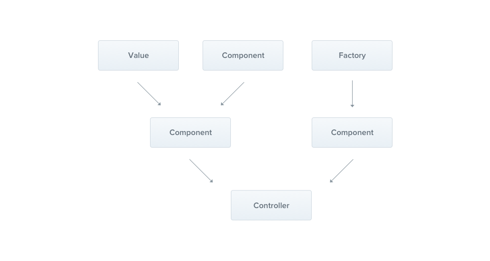

### Providers

프로바이더는 Nest에 존재하는 근본적인 개념이다. 많은 기본 Nest 클래스들은 프로바이더(서비스, 레포지터리, 팩토리, helper, 등등) 칭해진다. 프로바이더라는 내겸의 핵심 철학은 의존성으로 `주입 될 수 있다` 는 점이다. 이는 객체는 다른 객체들과 서로 다양한 관계를 생성할 수 있고, 이러한 객체들의 '연결'의 기능들은 주로 Nest 런타임 시스템에 위임될 수 있습니다.  



이전 챕터에서, 우리는 간간한 `CatsController`를 만들었습니다. 컨트롤러들은 HTTP 요청을 처리해야 하고, 더 복잡한 작업에 대해선 `Providers`에게 위임합니다. 프로바이더들은 순수한 JavaScript 클래스들이며, 이들을 모듈 안에서 `Providers` 로 선언합니다. 

> HINT
> Nest 가 좀더 객체 지향적 방법으로 의존성을 디자인하고, 구조화 하는게 가능해진 이래로, 우리는 SOLID 원칙을 따르기를 강력히 권장 합니다. 

### Services

이제 간단한 `CatsService` 를 생성해봅시다. 이 서비스는 데이터 저장, 재 탐색, 그리고 `CatsController`에 의해 사용될 목적으로 디자인 되었습니다. 그렇기에 프로바이더로 정의되기에 훌륭한 후보 입니다. 

```typescript
import { Injectable } from '@nestjs/common';
import { Cat } from './interfaces/cat.interface';

@Injectable()
export class CatsService {
  private readonly cats: Cat[] = [];

  create(cat: Cat) {
    this.cats.push(cat);
  }

  findAll(): Cat[] {
    return this.cats;
  }
}
```

> HINT 
> CLI 상에서 서비스를 생성하기 위해서, 간단히 `$ nest g service cats` 라고 입력하면 됩니다. 

생성한 서비스는 하나의 프로퍼티를 가지며, 두개의 메서드를 가진 기본적인 클래스입니다. 여기서 한가지 새로운 기능으로는 `@Injectable()` 이라는 데코레이터가 사용되었다는 점입니다. 이 데코레이터는 메타 데이터를 붙이는 역할을 하며, `CatsService` 가 Nest의 IoC 컨케이너에 의해 관리 될 수 있는 클래스라는 점을 선언하는 것입니다. 

```typescript
export interface Cat {
  name: string;
  age: number;
  breed: string;
}
```

서비스에 사용될 타입도 만들었으니, 이제는 서비스 클래스를 통해 고양이들을 탐색해볼 차례입니다. 

```typescript
import { Controller, Get, Post, Body } from '@nestjs/common';
import { CreateCatDto } from './dto/create-cat.dto';
import { CatsService } from './cats.service';
import { Cat } from './interfaces/cat.interface';

@Controller('cats')
export class CatsController {
  constructor(private catsService: CatsService) {}

  @Post()
  async create(@Body() createCatDto: CreateCatDto) {
    this.catsService.create(createCatDto);
  }

  @Get()
  async findAll(): Promise<Cat[]> {
    return this.catsService.findAll();
  }
}
```

`CatsService` 는 클래스 생성자를 통해 주입되었다. `private` 문법의 용례를 주의깊게 보세요. 이 짧은 문구를 통해 우리는 해당 프로바이더 멤버를 선언도 하고, 초기화도 즉시, 동일한 장소에서 해결할 수 있었습니다. 

### Dependency Injection

### Scopes

### Custom providers

### Optional providers

### Property-based injection

### Provider registration

### Manual instantiation
