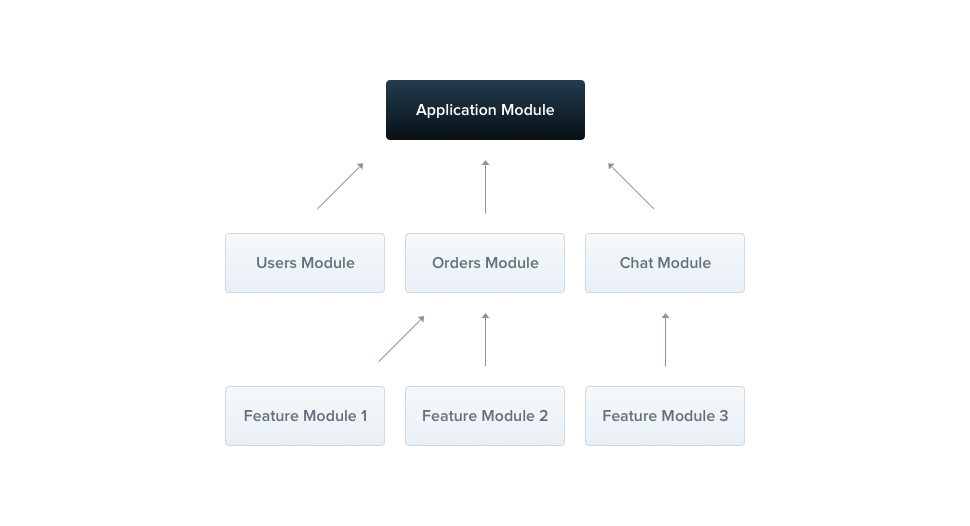
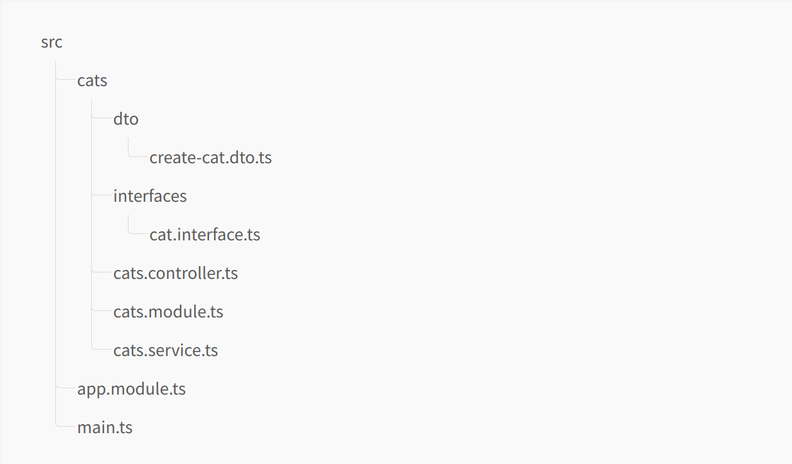
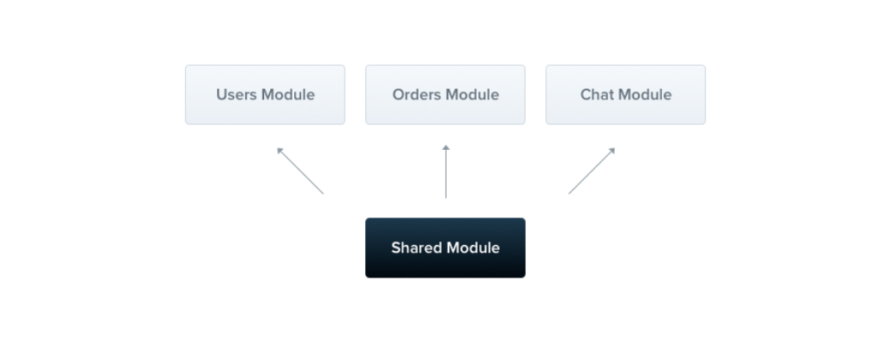

### Modules
`@Module()` 데코레이터를 어노테이션으로 달고 있는 클래스를 모듈이라고 부릅니다. `@Module()` 데코레이터는 Nest 가 어플리케이션의 구조를 조직화하는데 사용하는 메타 데이터들을 제공해줍니다.



각 어플리케이션은 최소 하나의 모듈을 가지고 있고, 이를 `root` 모듈이라고 부릅니다. 루트모듈은 **어플리케이션 그래프** 를 생성하기위해 Nest가 사용하는 스타팅 포인트 역할을 합니다. application graph 라는 것은 Nest에서 모듈과 프로바이더 사이의 관련성, 의존성을 해결하기 위해 사용하는 것입니다. 이론적으로 작은 어플리케이션이라면 루트 모듈만 존재할 수도 있지만, 보통 일반적인 경우 그렇지 않습니다. 또한 Nest 에서는 당신의 컴포넌트 들을 조직화 할 때 효과적인 방법으로 가장 강력히 추천하는 것이 모듈형태로 사용하는 것을 강조하고 싶습니다. 따라서 대부분의 애플리케이션에서 결과 아키텍처는 여러 모듈을 사용하며 각 모듈은 밀접하게 관련된 기능 세트를 캡슐화하는 구조가 될 것입니다. 

`@Module()` 데코레이터는 모듈을 묘사하기 위한 프로퍼티를 가진 단일 객체를 취합니다. 

| 이름 | 설명 |
|:---- | :--- |
|providers|프로바이더는 Nest 의 주입기에 의해 인스턴스화 하며, 특정 모듈을 최소 넘어서서 공유될 것입니다. |
|controllers|특정 모듈에 정의 내려진 일련의 컨트롤러들은 반드시 인스턴스화 되어야 합니다.| 
|imports|해당 모듈 안에서 필요로 되어지는 프로바이더들을 export하는 모듈들의 리스트입니다.|
|exports|프로바이더들의 하위 셋으로, 이는 특정 이 모듈에 의해 제공되는 기능들로 볼 수 있으며, 이는 다른 모듈에 의해 이용이 가능한 일련의 프로바이더들을 담고 있습니다. 당신은 여기서도 프로바이더 자체를 혹은 단순히 `provide` 값의 토큰 만을 제공할 수도 있습니다.|

모들은 기본적으로 프로바이더들을 '캡슐화'합니다. 이는 현재 모듈의 직접 일부도 아니고 가져온 모듈에서 내보내지지도 않은 공급자를 주입하는 것이 불가능하다는 것을 의미합니다. 따라서 모듈에서 내보낸 공급자(exported Providers)를 모듈의 공용 인터페이스 또는 API로 간주할 수 있습니다

### Features modules 
`CatscController` 와 `CatsService`는 동일한 어플리케이션 도메인에 속합니다. 그들이 밀접하게 관련성을 가진 것 처럼, 이들을 feature module 로 이동시키는 것도 가능합니다. `feature module` 은 특정 기능, 조직화된 코드를 유지하고, 명확한 경계를 만드는데 사용됩니다. 이는 우리가 복잡함을 관리하고, 팀이 성장 혹은 어플리케이션의 사이즈가 성장할 때 특히 [SOLID]()원칙을 지키며 개발하는 것을 도와줍니다. 

위의 설명대로 시연하고자, `CatsModule` 을 생성해봅시다. 
```typescript
// CatsModule
import { Module } from '@nestjs/common';
import { CatsController } from './cats.controller';
import { CatsService } from './cats.service';

@Module({
  controllers: [CatsController],
  providers: [CatsService],
})
export class CatsModule {}
```

> HINT 
> CLI로 모듈을 생성하기 위해선 다음과 같이 명령어를 치면 됩니다. `> nest g module cats`

위처럼, 우리는 `cats.module.ts` 안에 `CatasModule` 을 정의내렸습니다. 그리고 `cats`디렉토리에 이 모듈과 연관이 있는 모든 곳으로 옮겨 다닐 수 있게 되었습니다. 이제 마지막 남은 우리의 일은 root 모듈이 이 모듈을 import 하는 것입니다.(`AppModule` 로)
```typescript
// app.module.ts 
import { Module } from '@nestjs/common';
import { CatsModule } from './cats/cats.module';

@Module({
  imports: [CatsModule],
})
export class AppModule {}
```
이제 전체 구조는 다음처럼 보이게 됩니다. 



### Shared modules
Nest는 기본적으로 싱글톤 디자인으로 모듈이 구성되어 있습니다. 그래서 만약 목수의 모듈들에서 효율적으로 어떤 프로바이더의 인스턴스를 같이 공유하고, 사용할 수 있게 되입니다. 

()

모든 모듈들은 자동적으로 **shared module**이 됩니다. 일단 어떤 모듈이든지 간에 생성된 이래 

### Module re-exporting
### Dependency injection 
### Global modules 
### Dynamic moudles 