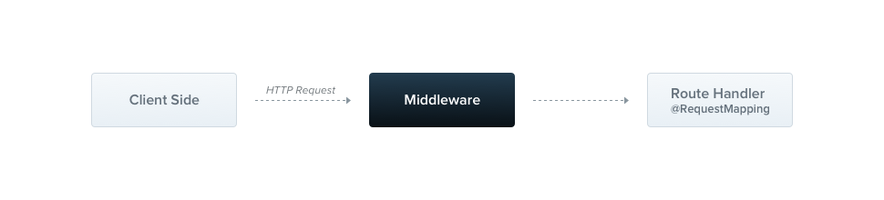

### Middleware
미들웨어는 route handler 이전에 호출될 수 있는 함수입니다. 미들웨어 함수들은 request 와 response 에,  그리고 요청-응답 사이클 안에 있는 `next()` 미들웨어 함수에 접근할 수 있습니다. `next` 미들웨어 함수는 일반적으로 `next` 라는 변수명에 의해 언급되는 함수들을 말합니다. 



기본적으로, Nest 미들웨어들은 `express` 미들웨어들과 동등합니다. 다음의 공식 express 문서의 묘사에 나오는 묘사들이 미들웨어가 할 수 있는 일들입니다. 

> 미들웨어 함수들은 다음 일들을 할 수 있습니다. :
> - 어떤 코드든 실행할 수 있다. 
> - 요청과 응답 객체를 변경할 수 있다.
> - 요청-응답 사이클의 종료 시킬 수 있다.
> - 스택 상에서 next 미들웨어 함수들을 호출할 수 있다. 
> - 요청-응답의 사이클을 현재 미들웨어 함수가 종료시키지 않는다면, 해당 미들웨어는 다음 미들웨어 함수에게 제어권을 전달하기 위해 반드시 `next()` 를 호출해야한다. 그렇지 않으면 요청이 중단된 상태로 유지됩니다. 

`@Injectable()` 데코레이터오 함께 함수 혹은 클래스 양 쪽 중 당신이 커스텀 Nest 미들웨어를 구현하실 수 있습니다. 클래스는 반드시 `NestMiddleware` 인터페이스를 구현하여야 하며, 반면에 함수의 경우 특별하게 요구사항은 존재 하지 않는다. 앞으로는 간단한 미들웨어 기능을 클래스 메소드를 사용하여 구현해보고자 합니다. 

> WARNING
> `Express` 그리고 `fstify` 는 미들웨어를 다르게 처리하고 다른 메서드 시그니쳐를 제공합니다. 이에 대해선 [여기](https://docs.nestjs.com/techniques/performance#middleware)를 참고해주세요. 

```typescript
// logger.middleware.ts
import { Injectable, NestMiddleware } from '@nestjs/common';
import { Request, Response, NextFunction } from 'express';

@Injectable()
export class LoggerMiddleware implements NestMiddleware {
  use(req: Request, res: Response, next: NextFunction) {
    console.log('Request...');
    next();
  }
}
```

### Dependenct injection 
Nest 미들웨어는 의존성 주입을 완벽하게 지원합니다. 그냥 프로바이더, 컨트롤러에 넣어주시면, 동일한 모듈 내에서 이용가능한 의존성을 주입할 수 있습니다. 일반적으로 `constructor(생성자)`를 통해 전달 됩니다.  

### Applying middleware
`@Module()` 데코레이터 안에는 미들웨어를 위한 공간은 기본적으로 없습니다. 대신에, 우리는 모듈 클래스 내의 `configure()` 라는 메서드를 사용함으로써 설정을 해줄 수 있습니다. 미들웨어를 포함하는 모듈들은 반드시 `NestModule` 인터페이스를 구현하고 있어야 합니다. `AppModule` 레벨에서 `LoggerMiddleware` 를 설정해 봅시다. 

```typescript
// app.module.ts
import { Module, NestModule, MiddlewareConsumer } from '@nestjs/common';
import { LoggerMiddleware } from './common/middleware/logger.middleware';
import { CatsModule } from './cats/cats.module';

@Module({
  imports: [CatsModule],
})
export class AppModule implements NestModule {
  configure(consumer: MiddlewareConsumer) {
    consumer
      .apply(LoggerMiddleware)
      .forRoutes('cats');
  }
}
```
위의 예시에서 우리는 `CatsController` 안에 이전에 정의 내린 `/cats` 라우트 핸들러를 위한 `LoggerMiddleware` 를 설치한 예시를 볼 수 있습니다. 우리는 게다가 미들웨어를 설정할 때, `forRoutes()` 메서드로 `path` 루트를 포함하는 객체, 요청 `method` 를 전달해 줌으로써, 특정 요청 메서드에 미들웨어를 제한할수도 있습니다. 하단의 예시는, 요구되는 요청 메서드 타입을 참조한 `RequestMethod` 열거형을 import 한 것에 주목하여 주세요.

```typescript 
// app.module.ts
import { Module, NestModule, RequestMethod, MiddlewareConsumer } from '@nestjs/common';
import { LoggerMiddleware } from './common/middleware/logger.middleware';
import { CatsModule } from './cats/cats.module';

@Module({
  imports: [CatsModule],
})
export class AppModule implements NestModule {
  configure(consumer: MiddlewareConsumer) {
    consumer
      .apply(LoggerMiddleware)
      .forRoutes({ path: 'cats', method: RequestMethod.GET });
  }
}
```

> HINT
> `configure()` 메소드는 `async/await` 키워드를 사용함으로써 비동기적으로 수행될 수 있습니다.(예를 들어 당신은 `configure()` 메소드 바디 안에 비동기 작업의 완수를 `await`할 수 있습니다.)

> WARNNING 
> `express` 어댑터를 사용할 때, NestJS 앱은 기본적으로 `body-parser` 패키지로부터 `json` 그리고 `urlencoded`를 자동적으로 import 합니다. 이렇게 한다는 것은 당신이 `MiddlewareConsumer` 를 경유하는 미들웨어 그것을 커스터마이징 하길 원한다면, 당신이 `NestFactory.create()` 와 함께 어플리케이션을 실행할 때, `false` 플래그를 `bodyParser` 플래그에 설정함으로써 전역 미들웨어를 꺼야 한다는 것을 의미합니다. 

### Route wildcards
라우트를 기반으로 패턴들 또한 지원됩니다. 예를 들어 `*` 의 경우 **wildcard** 로 사용됩니다. 그리고 이는 어떤 조합의 문자열도 매치됩니다. 

```typescript
forRoutes({ path: 'ab*cd', method: RequestMethod.ALL });
```

`ab*cd`루트 패스는 `abcd`, `ab_cd`, `abecd` 등등과 매치가 될 것입니다. 문자열 `?`, `+`, `*` , `()` 와 같은 것들은 정규 표현식들 중의 하부 셋이고, 루트 패스로 역할을을 해줍니다.

> WARNING 
> `fstify` 패키지는 `path-to-regexp` 의 최신 버전을 사용합니다. 이 패키지는 `*`, 와일드카드 기능을  이상 지원하지 않습니다. 대신에 당신은 인자들을 반드시 사용해야합니다(예시, `(.*)`, `:splat*`).

### Middleware consumer
`MiddlewareConsumer` 는 helper 클래스입니다. 이것은 미들웨어를 관리하기 위해 몇가지 빌트인 메서드를 제공해줍니다. 그것들 모두는 간단하게 [`fulent Style`](https://en.wikipedia.org/wiki/Fluent_interface) 방식으로 연쇄 연결 되어 있습니다. `forRoutes()` 메서드는 단일 스트링, 복수의 스트링, `RouteInfo` 객체, 컨트롤러 클래스, 심지어 복수의 컨트롤러 클래스를 취할 수 있습니다. 콤마로 구분된 컨트롤러의 배열을 일반적으로 전달할 것입니다. 아래는 단일 컨트롤러를 사용한 예시를 보여줍니다. 

```typescript
// app.module.ts
import { Module, NestModule, MiddlewareConsumer } from '@nestjs/common';
import { LoggerMiddleware } from './common/middleware/logger.middleware';
import { CatsModule } from './cats/cats.module';
import { CatsController } from './cats/cats.controller';

@Module({
  imports: [CatsModule],
})
export class AppModule implements NestModule {
  configure(consumer: MiddlewareConsumer) {
    consumer
      .apply(LoggerMiddleware)
      .forRoutes(CatsController);
  }
}
```
> HINT 
> `apply()` 메서드는 단일 미들웨어 취하거나, 여러 미들웨어를 지정하기 위하여 복수의 인자들을 취합니다. 

### Excluding routes
적용된 미들웨를 취하는 것으로부터 특정 루트들은 배제하길 원할 때가 있습니다. 이런 경우 `exclude()` 메서드를 가지고 특정 루트를 쉽게 배제할 수 있습니다. 이 메서드는 단일 스트링을 취하거나, 다수의 스트링을 취할수 있으며, 혹은 `RouteInfo` 객체를 통해 배제할 루트들을 특정할 수 있습니다. 

```typescript
consumer
  .apply(LoggerMiddleware)
  .exclude(
    { path: 'cats', method: RequestMethod.GET },
    { path: 'cats', method: RequestMethod.POST },
    'cats/(.*)',
  )
  .forRoutes(CatsController);
```

> HINT 
> `exclude()` 메서드는 [path-to-regexp](https://github.com/pillarjs/path-to-regexp#parameters) 패키지를 사용함으로써 와일드카드 인자를 받는 것도 지원합니다. 

위의 예시를 통해, `LoggerMiddleware`는 `exclude()`메서드로 지나가는 세개의 경우를 제외하고 `CatsController` 안에 정의된 모든 루트들이 연계되었습니다. 

### Functional middleware
우리가 사용 중인 `LoggerMiddleware`은 꽤나 심플합니다. 멤버도 없으며, 추가적인 메서드도 존재하지 않고, 의존성도 없습니다. 이렇다면 그저 간단한 함수를 클래스 대신해서 정의 내리는게 낫지 않을까요? 실제로, 그렇게 만드는 것이 가능합니다. 이러한 미들웨어의 형태를 `functional middleware` 라고 부릅니다. 그럼 이제 클래스 기반의 로거 미들웨어를 함수 미들웨어 형태로 만들어보고, 그 차이를 보겠습니다. 

```typescript 
//logger.middleware.ts
import { Request, Response, NextFunction } from 'express';

export function logger(req: Request, res: Response, next: NextFunction) {
  console.log(`Request...`);
  next();
};
```

이렇게 구성하고 `AppModule`에서는 이렇게 적용합니다. 

```typescript 
// app.module.ts
consumer
    .apply(logger)
    .forRoutes(CatsController);
```

> HINT
> 추가적인 의존성이 필요 없다면, 당신의 미들웨어에 대해선 언제든 대안적으로 `functional middleware`가 더 쉽게 사용할 수 있다는 점을 기억하세요.

### Multiple middleware

위에서 언급했듯이, 순차적이게 실행되는 복수의 미들웨어를 연결하기 위해서, 간단하게 `apply()` 메서드 안에 컴마로 구분된 배열을 제공하면 됩니다. 

```typescript
consumer.apply(cors(), helmet(), logger).forRoutes(CatsController);
```

### Global middleware
만약 당신이 모든 등록된 루트에 한번에 미들웨어를 연결시키길 원한다면, `use()`메서드를 사용할 수 있고, 이는 `INestApplication` 인스턴스에 의해 제공될 것입니다. 

```typescript
// main.ts
const app = await NestFactory.create(AppModule);
app.use(logger);
await app.listen(3000);
```

> HINT
> 글로벌 미들웨어 안에 의존성 주입 컨테이너를 접속시키는 것은 불가능하다. `app.use()` 를 사용해야할 때 대신에 함수형 미들웨어를 사용할 수 있다. 대안적으로 클래스 미들웨어를 사용하고, 이를 `.forRoutes('*')`와 `AppModule`(혹은 어떤 다른 모듈도) 과 함께 사용하면 된다. 