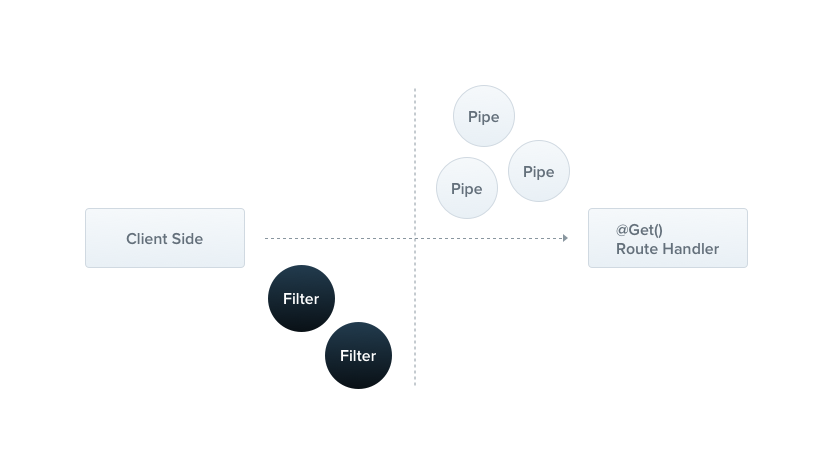

### Exception filters
Nest는 애플리케이션 전반에서 처리되지 않은 모든 예외를 처리하는 내장 예외 계층을 제공합니다. 애플리케이션 코드에서 처리되지 않은 예외가 발생하면 이 계층에서 이를 포착하여 자동으로 적절한 사용자 친화적인 응답을 보냅니다.



기본적으로 이 작업은 내장된 전역 예외 필터에 의해 수행되며, 이는 HttpException 타입(및 이를 상속받은 하위 클래스)의 예외들을 처리합니다. 예외가 인식되지 않을 경우(HttpException이나 HttpException을 상속받은 클래스가 아닌 경우), 내장 예외 필터는 기본 JSON 응답을 생성합니다.

```json
{
    "statusCode": 500,
    "message": "Internal server error"
}
```

> #### HINT
> 전역 예외 필터는 `http-errors` 라이브러리를 부분적으로 지원합니다. 기본적으로 `statusCode`와 `message` 속성을 포함하는 모든 발생한 예외는 적절히 처리되어 응답으로 전송됩니다(인식되지 않은 예외에 대한 기본값인 `InternalServerErrorException` 대신).

#### Throwing standard exceptions
Nest는 `@nestjs/common` 패키지에서 제공되는 내장 `HttpException` 클래스를 제공합니다. 일반적인 HTTP REST/GraphQL API 기반 애플리케이션에서는 특정 오류 상황이 발생했을 때 표준 HTTP 응답 객체를 전송하는 것이 가장 좋은 방법입니다.

예를 들어, `CatsController`에서 `findAll()` 메서드(`GET` 라우트 핸들러)가 있다고 가정해보겠습니다. 이를 설명하기 위해 이 라우트 핸들러가 어떤 이유로 예외를 발생시킨다고 가정해보겠습니다. 다음과 같이 하드코딩으로 구현해보겠습니다.

```Typescript
// cats.controller.ts
@Get()
async findAll() {
  throw new HttpException('Forbidden', HttpStatus.FORBIDDEN);
}
```

> #### HINT
> 여기서 우리는 `HttpStatus`를 사용했는데, 이는 `@nestjs/common` 패키지에서 가져온 도우미 열거형(helper enum)입니다.

클라이언트가 이 엔드포인트를 호출하면, 응답은 다음과 같이 나타납니다:

```json
{
    "statusCode": 403,
    "message": "Forbidden"
}
```

`HttpException` 생성자는 응답을 결정하는 두 가지 필수 인자를 받습니다:

* `response` 인자는 JSON 응답 본문을 정의합니다. 아래 설명된 대로 `string` 또는 `object`가 될 수 있습니다.
* `status` 인자는 **HTTP 상태 코드**를 정의합니다.

기본적으로 JSON 응답 본문은 두 가지 속성을 포함합니다:
* `statusCode`: `status` 인자에 제공된 HTTP 상태 코드가 기본값입니다
* `message`: `status`에 기반한 HTTP 에러에 대한 간단한 설명입니다

JSON 응답 본문의 메시지 부분만 재정의하려면 `response` 인자에 문자열을 제공하면 됩니다. 전체 JSON 응답 본문을 재정의하려면 `response` 인자에 객체를 전달하세요. Nest는 이 객체를 직렬화하여 JSON 응답 본문으로 반환합니다.

두 번째 생성자 인자인 `status`는 유효한 HTTP 상태 코드여야 합니다. 가장 좋은 방법은 `@nestjs/common`에서 가져온 `HttpStatus` 열거형을 사용하는 것입니다.

**세 번째** 생성자 인자(선택사항)인 `options`는 에러의 **원인**을 제공하는 데 사용할 수 있습니다. 이 `cause` 객체는 응답 객체로 직렬화되지 않지만, `HttpException`이 발생하게 된 내부 에러에 대한 귀중한 정보를 제공하여 로깅 목적으로 유용하게 사용될 수 있습니다.

다음은 전체 응답 본문을 재정의하고 에러 원인을 제공하는 예시입니다:

```Typescript
// cats.controller.ts
@Get()
async findAll() {
  try {
    await this.service.findAll()
  } catch (error) {
    throw new HttpException({
      status: HttpStatus.FORBIDDEN,
      error: 'This is a custom message',
    }, HttpStatus.FORBIDDEN, {
      cause: error
    });
  }
}
```
위의 방법을 사용하면 응답은 다음과 같이 나타날 것입니다:

```json
{
  "status": 403,
  "error": "This is a custom message"
}
```
#### Custom exceptions 
대부분의 경우에는 다음 섹션에서 설명하는 것처럼 Nest의 내장 HTTP 예외를 사용하면 되므로 사용자 정의 예외를 직접 작성할 필요가 없습니다. 하지만 사용자 정의 예외를 만들어야 하는 경우, 기본 `HttpException` 클래스를 상속받는 자체 **예외 계층**을 만드는 것이 좋은 방법입니다. 이러한 접근 방식을 사용하면 Nest가 여러분의 예외들을 인식하고 자동으로 에러 응답을 처리할 것입니다. 다음과 같이 사용자 정의 예외를 구현해보겠습니다:

```Typescript
// forbidden.exception.ts
export class ForbiddenException extends HttpException {
  constructor() {
    super('Forbidden', HttpStatus.FORBIDDEN);
  }
}
```

`ForbiddenException`이 기본 `HttpException`을 상속받기 때문에, 내장된 예외 처리기와 원활하게 작동할 것입니다. 따라서 우리는 이를 `findAll()` 메서드 내에서 사용할 수 있습니다.

```Typescript
// cats.controller.ts
@Get()
async findAll() {
  throw new ForbiddenException();
}
```

#### Built-in HTTP exceptions
Nest는 기본 `HttpException`을 상속받는 일련의 표준 예외들을 제공합니다. 이들은 `@nestjs/common` 패키지에서 제공되며, 가장 일반적인 HTTP 예외들을 나타냅니다:

* `BadRequestException` - 잘못된 요청 예외
* `UnauthorizedException` - 인증되지 않은 예외
* `NotFoundException` - 찾을 수 없음 예외
* `ForbiddenException` - 금지된 예외
* `NotAcceptableException` - 허용되지 않는 예외
* `RequestTimeoutException` - 요청 시간 초과 예외
* `ConflictException` - 충돌 예외
* `GoneException` - 사라진 리소스 예외
* `HttpVersionNotSupportedException` - 지원되지 않는 HTTP 버전 예외
* `PayloadTooLargeException` - 너무 큰 페이로드 예외
* `UnsupportedMediaTypeException` - 지원되지 않는 미디어 타입 예외
* `UnprocessableEntityException` - 처리할 수 없는 엔티티 예외
* `InternalServerErrorException` - 내부 서버 에러 예외
* `NotImplementedException` - 구현되지 않은 예외
* `ImATeapotException` - I'm a teapot 예외
* `MethodNotAllowedException` - 허용되지 않는 메서드 예외
* `BadGatewayException` - 잘못된 게이트웨이 예외
* `ServiceUnavailableException` - 서비스 사용 불가 예외
* `GatewayTimeoutException` - 게이트웨이 시간 초과 예외
* `PreconditionFailedException` - 사전 조건 실패 예외

모든 내장 예외들은 `options` 매개변수를 사용하여 에러의 `cause`(원인)와 에러 설명을 모두 제공할 수 있습니다:

```Typescript
throw new BadRequestException('Something bad happened', {
  cause: new Error(),
  description: 'Some error description',
});
```

위의 방법을 사용하면 응답은 다음과 같이 나타날 것입니다:

```json
{
  "message": "Something bad happened",
  "error": "Some error description",
  "statusCode": 400
}
```

#### Exception filters
기본(내장) 예외 필터가 많은 경우를 자동으로 처리할 수 있지만, 때로는 예외 계층에 대한 **완전한 제어**가 필요할 수 있습니다. 예를 들어, 로깅을 추가하거나 동적 요인에 따라 다른 JSON 스키마를 사용하고 싶을 수 있습니다. **예외 필터**는 바로 이러한 목적을 위해 설계되었습니다. 이를 통해 클라이언트에 보내는 응답의 정확한 제어 흐름과 내용을 관리할 수 있습니다.

`HttpException` 클래스의 인스턴스인 예외들을 잡아내고 이들에 대한 사용자 정의 응답 로직을 구현하는 예외 필터를 만들어보겠습니다. 이를 위해서는 기본 플랫폼의 `Request`와 `Response` 객체에 접근해야 합니다. `Request` 객체를 사용하여 원본 `url`을 추출하고 이를 로깅 정보에 포함시킬 것입니다. 그리고 `Response` 객체의 `response.json()` 메서드를 사용하여 전송되는 응답을 직접 제어할 것입니다.

```Typescript
// http-exception.filter.ts

import { ExceptionFilter, Catch, ArgumentsHost, HttpException } from '@nestjs/common';
import { Request, Response } from 'express';

@Catch(HttpException)
export class HttpExceptionFilter implements ExceptionFilter {
  catch(exception: HttpException, host: ArgumentsHost) {
    const ctx = host.switchToHttp();
    const response = ctx.getResponse<Response>();
    const request = ctx.getRequest<Request>();
    const status = exception.getStatus();

    response
      .status(status)
      .json({
        statusCode: status,
        timestamp: new Date().toISOString(),
        path: request.url,
      });
  }
}
```

> #### HINT
> 모든 예외 필터는 제네릭 `ExceptionFilter<T>` 인터페이스를 구현해야 합니다. 이를 위해서는 지정된 시그니처를 가진 `catch(exception: T, host: ArgumentsHost)` 메서드를 제공해야 합니다. 여기서 `T`는 예외의 타입을 나타냅니다.

> #### WARNING
> 만약 `@nestjs/platform-fastify`를 사용하고 있다면, `response.json()` 대신 `response.send()`를 사용할 수 있습니다. Fastify의 올바른 타입들을 import하는 것을 잊지 마세요.

`@Catch(HttpException)` 데코레이터는 예외 필터에 필요한 메타데이터를 바인딩하여, 이 특정 필터가 `HttpException` 타입의 예외만을 찾고 있다는 것을 Nest에 알려줍니다. `@Catch()` 데코레이터는 단일 매개변수를 받을 수도 있고, 쉼표로 구분된 목록을 받을 수도 있습니다. 이를 통해 여러 타입의 예외들을 한 번에 처리하는 필터를 설정할 수 있습니다.

#### Arguments host
`catch()` 메서드의 매개변수들을 살펴보겠습니다. `exception` 매개변수는 현재 처리 중인 예외 객체입니다. `host` 매개변수는 `ArgumentsHost` 객체입니다. `ArgumentsHost`는 강력한 유틸리티 객체로, [**실행 컨텍스트 챕터**](https://docs.nestjs.com/fundamentals/execution-context)에서 더 자세히 살펴볼 것입니다. 

이 코드 예제에서는 `ArgumentsHost`를 사용하여 원래 요청 핸들러(예외가 발생한 컨트롤러)에 전달된 `Request`와 `Response` 객체에 대한 참조를 얻습니다. 우리는 `ArgumentsHost`의 헬퍼 메서드들을 사용하여 원하는 `Request`와 `Response` 객체를 가져왔습니다. `ArgumentsHost`에 대해 더 자세히 알아보려면 [**여기**](https://docs.nestjs.com/fundamentals/execution-context)를 참조하세요.

이러한 수준의 추상화가 필요한 이유는 `ArgumentsHost`가 모든 컨텍스트(예: 현재 다루고 있는 HTTP 서버 컨텍스트뿐만 아니라 마이크로서비스와 웹소켓 등)에서 작동하기 때문입니다. 실행 컨텍스트 챕터에서는 `ArgumentsHost`와 그 헬퍼 함수들을 사용하여 **모든** 실행 컨텍스트에서 적절한 [**기본 인자들**](https://docs.nestjs.com/fundamentals/execution-context#host-methods)에 어떻게 접근할 수 있는지 살펴볼 것입니다. 이를 통해 모든 컨텍스트에서 작동하는 일반적인 예외 필터를 작성할 수 있게 됩니다.

#### Binding filters
`CatsController`의 `create()` 메서드에 새로 만든 `HttpExceptionFilter`를 연결해보겠습니다.

```Typescript
// cats.controller.ts

@Post()
@UseFilters(new HttpExceptionFilter())
async create(@Body() createCatDto: CreateCatDto) {
  throw new ForbiddenException();
}
```

> #### HINT
> `@UseFilters()` 데코레이터는 `@nestjs/common` 패키지에서 import됩니다.

여기서 우리는 `@UseFilters()` 데코레이터를 사용했습니다. `@Catch()` 데코레이터와 마찬가지로, 이는 단일 필터 인스턴스나 쉼표로 구분된 필터 인스턴스 목록을 받을 수 있습니다. 이 예시에서는 `HttpExceptionFilter`의 인스턴스를 그 자리에서 생성했습니다. alternatively 또는 클래스를 인스턴스 대신 전달할 수 있으며, 이 경우 인스턴스 생성의 책임을 프레임워크에 맡기게 되어 **의존성 주입**이 가능해집니다.

```Typescript
// cats.controller.ts

@Post()
@UseFilters(HttpExceptionFilter)
async create(@Body() createCatDto: CreateCatDto) {
  throw new ForbiddenException();
}
```

> #### HINT
> 가능한 경우 인스턴스 대신 클래스를 사용하여 필터를 적용하는 것이 좋습니다. Nest가 모듈 전체에서 동일한 클래스의 인스턴스를 쉽게 재사용할 수 있기 때문에 **메모리 사용량**이 감소합니다.

위 예시에서 `HttpExceptionFilter`는 단일 `create()` 라우트 핸들러에만 적용되어 메서드 범위로 지정됩니다. 예외 필터는 컨트롤러/리졸버/게이트웨이의 메서드 범위, 컨트롤러 범위 또는 전역 범위와 같은 다양한 수준에서 범위를 지정할 수 있습니다. 예를 들어, 필터를 컨트롤러 범위로 설정하려면 다음과 같이 하면 됩니다:

```Typescript
// cats.controller.ts

@UseFilters(new HttpExceptionFilter())
export class CatsController {}
```

이 구성은 `CatsController` 내에 정의된 모든 라우트 핸들러에 대해 `HttpExceptionFilter`를 설정합니다.

전역 범위 필터를 만들려면 다음과 같이 하면 됩니다:

```Typescript

async function bootstrap() {
  const app = await NestFactory.create(AppModule);
  app.useGlobalFilters(new HttpExceptionFilter());
  await app.listen(process.env.PORT ?? 3000);
}
bootstrap();
```
여기 한국어 번역입니다:

> #### WARNING
> `useGlobalFilters()` 메서드는 게이트웨이나 하이브리드 애플리케이션에 대한 필터를 설정하지 않습니다.

전역 범위 필터는 모든 컨트롤러와 모든 라우트 핸들러에 대해 전체 애플리케이션에서 사용됩니다. 의존성 주입 측면에서, 모듈 외부에서 등록된 전역 필터(위 예시처럼 `useGlobalFilters()`를 사용)는 모듈의 컨텍스트 외부에서 수행되므로 의존성을 주입할 수 없습니다. 이 문제를 해결하기 위해 다음 구성을 사용하여 **모듈에서 직접** 전역 범위 필터를 등록할 수 있습니다:

```Typescript
// app.module.ts

import { Module } from '@nestjs/common';
import { APP_FILTER } from '@nestjs/core';

@Module({
  providers: [
    {
      provide: APP_FILTER,
      useClass: HttpExceptionFilter,
    },
  ],
})
export class AppModule {}
```

> #### HINT
> 필터에 대한 의존성 주입을 수행하기 위해 이 접근 방식을 사용할 때, 이 구성이 사용되는 모듈에 관계없이 필터는 사실상 전역적이라는 점에 유의하세요. 어디에서 이루어져야 할까요? 필터(위 예시의 `HttpExceptionFilter`)가 정의된 모듈을 선택하세요. 또한, `useClass`가 사용자 지정 프로바이더 등록을 처리하는 유일한 방법은 아닙니다. [**여기**](https://docs.nestjs.com/fundamentals/custom-providers)에서 자세히 알아보세요.

이 기술을 사용하여 필요한 만큼 많은 필터를 추가할 수 있습니다; 단순히 각각을 providers 배열에 추가하면 됩니다.

#### Catch everything
**모든** 처리되지 않은 예외를 잡기 위해서는 (예외 유형에 관계없이), `@Catch()` 데코레이터의 매개변수 목록을 비워두세요, 예: `@Catch()`.

아래 예시에는 플랫폼에 구애받지 않는 코드가 있습니다. 이는 응답을 전달하기 위해 **HTTP 어댑터**를 사용하고, 플랫폼별 객체(`Request`와 `Response`)를 직접 사용하지 않기 때문입니다:

```Typescript

import {
  ExceptionFilter,
  Catch,
  ArgumentsHost,
  HttpException,
  HttpStatus,
} from '@nestjs/common';
import { HttpAdapterHost } from '@nestjs/core';

@Catch()
export class CatchEverythingFilter implements ExceptionFilter {
  constructor(private readonly httpAdapterHost: HttpAdapterHost) {}

  catch(exception: unknown, host: ArgumentsHost): void {
    // In certain situations `httpAdapter` might not be available in the
    // constructor method, thus we should resolve it here.
    const { httpAdapter } = this.httpAdapterHost;

    const ctx = host.switchToHttp();

    const httpStatus =
      exception instanceof HttpException
        ? exception.getStatus()
        : HttpStatus.INTERNAL_SERVER_ERROR;

    const responseBody = {
      statusCode: httpStatus,
      timestamp: new Date().toISOString(),
      path: httpAdapter.getRequestUrl(ctx.getRequest()),
    };

    httpAdapter.reply(ctx.getResponse(), responseBody, httpStatus);
  }
}
```

> #### WARNING 
> 모든 것을 잡는 예외 필터와 특정 타입에 바인딩된 필터를 결합할 때, "모든 것을 잡는" 필터가 먼저 선언되어야 바인딩된 타입을 특정 필터가 올바르게 처리할 수 있습니다.

#### Inheritance
일반적으로, 애플리케이션 요구사항을 충족하도록 완전히 사용자 정의된 예외 필터를 만들 것입니다. 하지만 기본 제공되는 **전역 예외 필터**를 단순히 확장하고 특정 요소를 기반으로 동작을 재정의하고 싶은 경우가 있을 수 있습니다.

기본 필터에 예외 처리를 위임하려면, `BaseExceptionFilter`를 확장하고 상속된 `catch()` 메서드를 호출해야 합니다.

```Typescript
// all-exceptions.filter.ts

import { Catch, ArgumentsHost } from '@nestjs/common';
import { BaseExceptionFilter } from '@nestjs/core';

@Catch()
export class AllExceptionsFilter extends BaseExceptionFilter {
  catch(exception: unknown, host: ArgumentsHost) {
    super.catch(exception, host);
  }
}
```

> #### WARNING
> `BaseExceptionFilter`를 확장하는 메서드 범위와 컨트롤러 범위의 필터는 `new`로 인스턴스화하면 안 됩니다. 대신, 프레임워크가 자동으로 인스턴스화하도록 해야 합니다.

전역 필터는 기본 필터를 **확장할 수 있습니다**. 이는 다음 두 가지 방법 중 하나로 수행할 수 있습니다.

첫 번째 방법은 사용자 정의 전역 필터를 인스턴스화할 때 `HttpAdapter` 참조를 주입하는 것입니다:

```Typescript

async function bootstrap() {
  const app = await NestFactory.create(AppModule);

  const { httpAdapter } = app.get(HttpAdapterHost);
  app.useGlobalFilters(new AllExceptionsFilter(httpAdapter));

  await app.listen(process.env.PORT ?? 3000);
}
bootstrap();
```

두 번째 방법은 [**여기 표시된 대로**](https://docs.nestjs.com/exception-filters#binding-filters) `APP_FILTER` 토큰을 사용하는 것입니다.